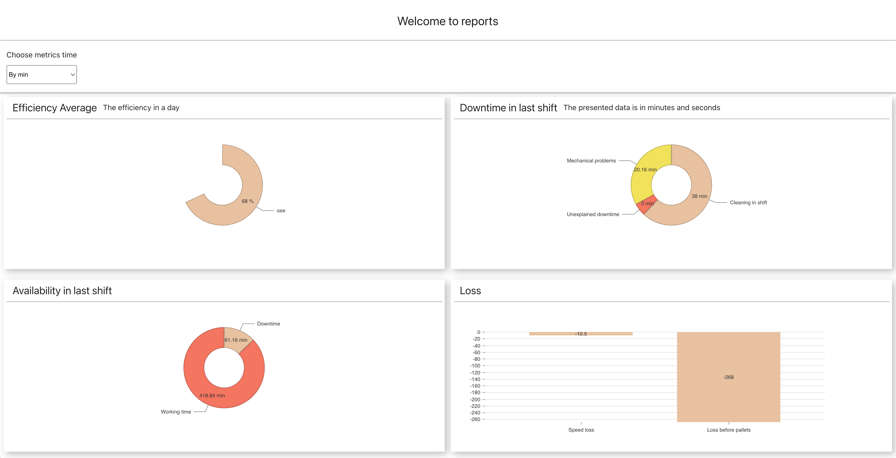

# Youtube freetime organizer

## Table of Contents

<!-- vscode-markdown-toc -->

1. [Intro](#Intro)
2. [Challenge](#Intro)
3. [Installation](#Installation)
   1. [React](#React)
4. [Usage](#Usage)
5. [Tests](#Tests)
   1. [Unit Tests](#unitTests)
   2. [E2E Tests](#e2eTests)

## 1. <a name='Intro'></a>Intro

The charts-challenge is frontend created in react to transform a sample of metrics data in a page view with charts.

## 3. 📦 <a name='Installation'></a>Installation

### 3.1 React

```
  npm install
  npm start
```

## 4. 📖 <a name='Usage'></a>Usage

In a manner to use a sample of data sent in the test I used a msw tool to mock requests response. With that, I was able to implement the ui with a backend representation where the request make from chart-challenge will get a proper data.

The frontend from this challenge is a simple one, it uses interactive charts and it was created a toolbox with metrics by time.

When clicked in the metrics time and selecting one of the options: by hour, by minutes, by secs, it will convert from one to other and update te charts bellow:

- Downtime in last shift
- Availability in last shift



---

## 5. 📄 <a name='Tests'></a>Tests

To this project it was used two types of test

1. Unit tests with jest
2. E2E with cypress.

### 5.1 📄 <a name='unitTests'></a>Unit tests

```
  npm run test:unit
```

### 5.2 📄 <a name='e2eTests'></a>E2E tests

```
  npm run test:e2e:run
```
